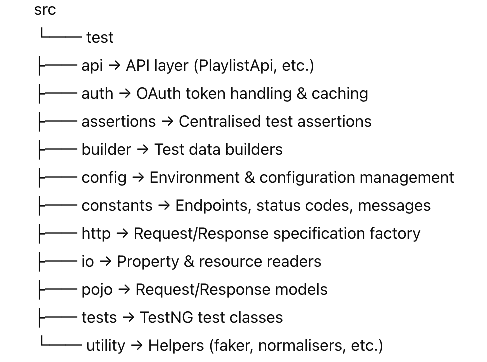

# Spotify API Automation Framework

A production-grade **API automation framework** built using **Rest Assured**, **TestNG**, and **Allure**, with **OAuth 2.0 authentication**, **parallel-safe tests**, and **CI/CD integration using GitHub Actions**.  
The latest test execution report is automatically published to **GitHub Pages**.

---

## Live Test Report

**Latest Allure Report (GitHub Pages)**  
https://nitishjha72.github.io/Spotify-RestAssured-API-Testing-Framework/

The report always reflects the **most recent CI run**.

---

## Tech Stack

- Java 21
- Rest Assured
- TestNG
- Allure
- Maven
- GitHub Actions
- OAuth 2.0 (Spotify API)

---

## Framework Architecture

The framework follows a **layered, scalable architecture**:



### Design Principles

- No `BaseTest` inheritance
- Stateless API layer
- Thread-safe token management
- Reusable request specifications
- Environment-driven configuration
- CI-friendly and parallel-safe

---

## Authentication Strategy

- Uses **OAuth 2.0 (Authorization Code + Refresh Token)**
- Access tokens are:
    - Fetched dynamically
    - Cached with expiry handling
    - Reused safely across parallel tests
- Sensitive data is **never committed to the repository**

### Secrets via environment variables

- `SPOTIFY_CLIENT_ID`
- `SPOTIFY_CLIENT_SECRET`
- `SPOTIFY_REFRESH_TOKEN`

---

## Environment Management

Supported environments:

- `dev`
- `qa` (default)

### Default execution (QA)

```bash
mvn clean test
```

## Parallel-Safe Testing

- Dynamic test data generation
- No shared mutable state
- Independent resource lifecycle per test
- Safe for parallel CI execution

---

## Reporting (Allure)

- Allure reports are generated after every test run
- Environment metadata is injected into the report
- Reports are:
  - Uploaded as CI artifacts
  - Published to GitHub Pages
- Only the **latest report** is published

### Local report viewing

```bash
allure open allure-report
```

## CI/CD Pipeline

Implemented using **GitHub Actions**.

### Triggers

- Push to main
- Pull requests
- Manual execution with environment selection
- Scheduled execution (every 7 days)

### Pipeline Steps

- Run API tests
- Generate Allure report
- Publish report to GitHub Pages
- Expose report link in workflow summary

---

## Logging & Security

- Authorization headers are masked in logs
- Sensitive form parameters are not logged
- No secrets appear in logs, reports, or the repository

---

## Sample Test Coverage

- Create playlist
- Get playlist
- Update playlist
- Validation error scenarios
- Authentication failure scenarios

---

## Notes

- Allure reports must be served over HTTP
- Opening `index.html` directly will not work due to browser security restrictions
- GitHub Pages provides a stable public URL for report access

---

## Author

**Nitish Jha**  
Senior SDET
